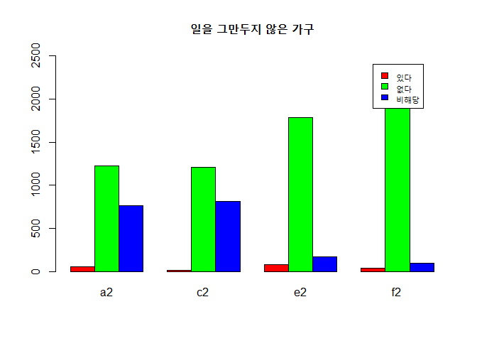

여성의 출산후 퇴사에 따른 가구의 경제력 변화
================

1.초록
======

현재 한국의 경제 상황을 보았을때 젊은 부부의 경우에는 맞벌이가 필수로 요구된다 할 수있다. 그러나 여성의 경우 출산을 하면 회사에서 퇴사의 압력을 받는일이 자주 일어나며 이는 곧바로 가정의 경제악화로 이어진다.

2.분석주제
==========

출산으로 인한 여성의 퇴사가 가족의 경제에 직접적으로 영향을 미치는가

3.데이터 선정
=============

서울연구데이터서비스에서 제공하는 서울복지실태조사2015 자료를 활용하였다. 조사대상의 출산후 퇴사여부, 부채여부, 경제적 만족도등이 상세히 조사되어있다. 설문지 조사의 형태로 되어있으며 각 항목당 보기를 고르는 형식이다. (<http://data.si.re.kr/sisurvey2015er17>)

4.분석
======

패키지 및 데이터 불러오기
-------------------------

### 작성을 위해 필요한 데이터와 패키지를 불러온다

``` r
library(dplyr)
```

    ## 
    ## Attaching package: 'dplyr'

    ## The following objects are masked from 'package:stats':
    ## 
    ##     filter, lag

    ## The following objects are masked from 'package:base':
    ## 
    ##     intersect, setdiff, setequal, union

``` r
library(ggplot2)
library(readxl)
raw <- read_excel("2015_서울복지실태조사_데이터.xlsx")
```

    ## Warning in read_fun(path = path, sheet_i = sheet, limits = limits, shim =
    ## shim, : Expecting logical in UM1007 / R1007C559: got '媛쒖씤援먯궗'

    ## Warning in read_fun(path = path, sheet_i = sheet, limits = limits, shim =
    ## shim, : Expecting logical in AES2190 / R2190C825: got '�쒓낏�꾩썝�앺솢'

    ## Warning in read_fun(path = path, sheet_i = sheet, limits = limits, shim =
    ## shim, : Expecting logical in PG2194 / R2194C423: got '1�멸�援�'

    ## Warning in read_fun(path = path, sheet_i = sheet, limits = limits, shim =
    ## shim, : Expecting logical in AES2247 / R2247C825: got '�쒓낏�꾩썝�앺솢'

    ## Warning in read_fun(path = path, sheet_i = sheet, limits = limits, shim =
    ## shim, : Expecting logical in AES2257 / R2257C825: got '�쒓낏�꾩썝�앺솢'

### 데이터 분석

``` r
#head(raw)
#tail(raw)
#view(raw)
#dim(raw)
#str(raw)
#summary(raw)
#보고서의 길이가 너무 길어져 임의로 비활성화
```

### 데이터 편집과 결측치 확인 및 제거

``` r
df_miss <- data.frame(raw)
df_miss <- df_miss%>%select(D9,B7_1,B7_2,B7_3,B7_4,B7_5,B7_6,B12,B14,B17)

table(is.na(df_miss$D9))
```

    ## 
    ## FALSE  TRUE 
    ##  2311   708

``` r
table(is.na(df_miss$B7_1))
```

    ## 
    ## FALSE 
    ##  3019

``` r
table(is.na(df_miss$B7_2))
```

    ## 
    ## FALSE 
    ##  3019

``` r
table(is.na(df_miss$B7_3))
```

    ## 
    ## FALSE 
    ##  3019

``` r
table(is.na(df_miss$B7_4))
```

    ## 
    ## FALSE 
    ##  3019

``` r
table(is.na(df_miss$B7_5))
```

    ## 
    ## FALSE 
    ##  3019

``` r
table(is.na(df_miss$B7_6))
```

    ## 
    ## FALSE 
    ##  3019

``` r
table(is.na(df_miss$B12))
```

    ## 
    ## FALSE 
    ##  3019

``` r
table(is.na(df_miss$B14))
```

    ## 
    ## FALSE 
    ##  3019

``` r
table(is.na(df_miss$B17))
```

    ## 
    ## FALSE 
    ##  3019

``` r
df<- df_miss%>%
  filter(!is.na(df_miss$D9))
str(df)  
```

    ## 'data.frame':    2311 obs. of  10 variables:
    ##  $ D9  : num  2 2 1 2 2 2 2 2 2 2 ...
    ##  $ B7_1: num  2 2 2 3 2 2 2 2 2 3 ...
    ##  $ B7_2: num  2 2 2 2 2 2 2 2 2 2 ...
    ##  $ B7_3: num  2 2 2 3 2 2 2 2 2 3 ...
    ##  $ B7_4: num  2 2 2 2 2 2 2 2 2 2 ...
    ##  $ B7_5: num  2 2 2 2 2 2 2 2 2 2 ...
    ##  $ B7_6: num  2 2 2 2 2 2 2 2 2 2 ...
    ##  $ B12 : num  3 4 3 3 3 3 2 3 2 3 ...
    ##  $ B14 : num  4 3 4 3 4 4 5 4 5 5 ...
    ##  $ B17 : num  0 0 6000 0 500 3500 3500 3000 0 0 ...

### 데이터 분석

``` r
##출산후 여성이 퇴사한 수와 퇴사하지 않은 수 비교
data_a <- df%>%
  group_by(D9)%>%
  summarise(n=n())
data_a
```

    ## # A tibble: 2 x 2
    ##      D9     n
    ##   <dbl> <int>
    ## 1    1.   272
    ## 2    2.  2039

``` r
ggplot(data = df,aes(x=D9))+geom_bar()
```


``` r
## 출산후 일을 그만둔 가구
df_1 <- df%>%
  group_by(D9)%>%
  filter(D9 == 1)
df_1
```

    ## # A tibble: 272 x 10
    ## # Groups:   D9 [1]
    ##       D9  B7_1  B7_2  B7_3  B7_4  B7_5  B7_6   B12   B14    B17
    ##    <dbl> <dbl> <dbl> <dbl> <dbl> <dbl> <dbl> <dbl> <dbl>  <dbl>
    ##  1    1.    2.    2.    2.    2.    2.    2.    3.    4.  6000.
    ##  2    1.    2.    2.    2.    2.    2.    2.    4.    4.     0.
    ##  3    1.    2.    1.    2.    2.    2.    2.    3.    4.  8000.
    ##  4    1.    2.    2.    2.    2.    2.    2.    3.    5. 10000.
    ##  5    1.    3.    2.    3.    2.    3.    2.    3.    4.  1000.
    ##  6    1.    3.    2.    3.    2.    3.    3.    3.    5.     0.
    ##  7    1.    3.    2.    3.    2.    3.    3.    4.    4.  5000.
    ##  8    1.    3.    2.    3.    2.    2.    2.    2.    5. 15000.
    ##  9    1.    3.    2.    2.    2.    2.    2.    3.    3.     0.
    ## 10    1.    3.    2.    3.    2.    2.    3.    2.    5.     0.
    ## # ... with 262 more rows

``` r
## 출산후 일을 그만두지 않은 가구
df_2 <- df%>%
  group_by(D9)%>%
  filter(D9 == 2)

df_2
```

    ## # A tibble: 2,039 x 10
    ## # Groups:   D9 [1]
    ##       D9  B7_1  B7_2  B7_3  B7_4  B7_5  B7_6   B12   B14   B17
    ##    <dbl> <dbl> <dbl> <dbl> <dbl> <dbl> <dbl> <dbl> <dbl> <dbl>
    ##  1    2.    2.    2.    2.    2.    2.    2.    3.    4.    0.
    ##  2    2.    2.    2.    2.    2.    2.    2.    4.    3.    0.
    ##  3    2.    3.    2.    3.    2.    2.    2.    3.    3.    0.
    ##  4    2.    2.    2.    2.    2.    2.    2.    3.    4.  500.
    ##  5    2.    2.    2.    2.    2.    2.    2.    3.    4. 3500.
    ##  6    2.    2.    2.    2.    2.    2.    2.    2.    5. 3500.
    ##  7    2.    2.    2.    2.    2.    2.    2.    3.    4. 3000.
    ##  8    2.    2.    2.    2.    2.    2.    2.    2.    5.    0.
    ##  9    2.    3.    2.    3.    2.    2.    2.    3.    5.    0.
    ## 10    2.    2.    2.    2.    2.    2.    2.    3.    5. 2000.
    ## # ... with 2,029 more rows

1이 퇴사를 한 경우 2가 퇴사를 하지 않은 경우로 퇴사를 하지 않은 인원이 훨씬 많음을 알 수 있다.

### 부채여부

``` r
##출산후 일을 그만둔 인원이 있는 가구중 부채가 없는 가구
a <- df_1%>%
  filter(B17 == 0)%>%
  group_by(B17)%>%
  summarise(an=n())%>%
  select(an)
a
```

    ## # A tibble: 1 x 1
    ##      an
    ##   <int>
    ## 1   146

``` r
##출산후 일을 그만둔 인원이 있는 가구중 부채가 있는 가구
b <- (df%>%
  group_by(D9)%>%
  summarise(bn=n())%>%
  filter(D9 == 1)-df_1%>%
  filter(B17 == 0)%>%
  group_by(B17)%>%
  summarise(bn=n()))%>%
  select(bn)

b
```

    ##    bn
    ## 1 126

``` r
##출산후 일을 그만두지 않은 인원이 있는 가구중 부채가 없는 가구

c <- df_2%>%
  filter(B17 == 0)%>%
  group_by(B17)%>%
  summarise(cn=n())%>%
  select(cn)
c
```

    ## # A tibble: 1 x 1
    ##      cn
    ##   <int>
    ## 1  1316

``` r
##출산후 일을 그만두지 않은 인원이 있는 가구중 부채가 있는 가구
d <- (df%>%
  group_by(D9)%>%
  summarise(dn=n())%>%
  filter(D9 == 2)-df_2%>%
  filter(B17 == 0)%>%
  group_by(B17)%>%
  summarise(dn=n()))%>%
  select(dn)
d
```

    ##    dn
    ## 1 723

``` r
df_grap <- data.frame(a,b,c,d)
df_grap
```

    ##    an  bn   cn  dn
    ## 1 146 126 1316 723

``` r
barplot(as.matrix(df_grap),main = "",
        beside = T, col = rainbow(nrow(df_grap)),ylim = c(0,1500))
```


x축 변수명이 그래프에 넣기에는 너무 길어 따로 후술한다. an은 출산후 일을 그만둔 인원이 있는 가구중 부채가 없는 가구, bn은 출산후 일을 그만둔 인원이 있는 가구중 부채가 있는 가구, cn은 출산후 일을 그만두지 않은 인원이 있는 가구중 부채가 없는 가구, dn은 출산후 일을 그만두지 않은 인원이 있는 가구중 부채가 있는 가구이다. 출산후 일을 그만두지 않은 가구의 경우 부채가 없는가구의 수가 부채가 있는 가구의 수의 2배가까이 되었으나 출산후 일을 그만둔 가구의 경우 부채가 있는 가구와 부채가 없는 가구의 차이가 미미했다.

### 가구별 현재 재정상태 만족

``` r
##출산후 일을 그만둔 가구
e <- df_1%>%
  group_by(B12)%>%
  summarise(en=n())%>%
  select(en)
e_1 <- data.frame(en=0)  
e<-bind_rows(e,e_1)
e
```

    ## # A tibble: 5 x 1
    ##      en
    ##   <dbl>
    ## 1    7.
    ## 2   44.
    ## 3  199.
    ## 4   22.
    ## 5    0.

``` r
##출산후 일을 그만두지 않은 가구
f <- df_2%>%
  group_by(B12)%>%
  summarise(fn=n())%>%
  select(fn)
f
```

    ## # A tibble: 5 x 1
    ##      fn
    ##   <int>
    ## 1    55
    ## 2   429
    ## 3  1345
    ## 4   206
    ## 5     4

``` r
df_grap2 <- data.frame(f,e)
df_grap2
```

    ##     fn  en
    ## 1   55   7
    ## 2  429  44
    ## 3 1345 199
    ## 4  206  22
    ## 5    4   0

``` r
barplot(as.matrix(df_grap2),main = "",
        beside = T, col = rainbow(nrow(df_grap2)),ylim = c(0,1500))
legend(8.5,1400,c("매우 어렵다","어려운 편이다","보통이다","넉넉한 편이다","매우 넉넉하다"),cex=0.8, fill=rainbow(nrow(df_grap2)))
```


일을 그만둔 가구와 그렇지 않은 가구의 재정 만족도 비율은 매우 유사하여 따로 차이점이 발견되지 않았다.

### 본인이 생각하는 본인 가구의 사회 경제적 지위

``` r
##출산후 일을 그만둔 가구
g <- df_2%>%
  group_by(B14)%>%
  summarise(gn=n())%>%
  select(gn)
g
```

    ## # A tibble: 6 x 1
    ##      gn
    ##   <int>
    ## 1     2
    ## 2    19
    ## 3   355
    ## 4   908
    ## 5   542
    ## 6   213

``` r
##출산후 일을 그만두지 않은 가구
h <- df_2%>%
  group_by(B14)%>%
  summarise(hn=n())%>%
  select(hn)
h  
```

    ## # A tibble: 6 x 1
    ##      hn
    ##   <int>
    ## 1     2
    ## 2    19
    ## 3   355
    ## 4   908
    ## 5   542
    ## 6   213

``` r
df_grap3 <- data.frame(g,h)
df_grap3
```

    ##    gn  hn
    ## 1   2   2
    ## 2  19  19
    ## 3 355 355
    ## 4 908 908
    ## 5 542 542
    ## 6 213 213

``` r
barplot(as.matrix(df_grap3),main = "",
        beside = T, col = rainbow(nrow(df_grap3)),ylim = c(0,1000))
legend(13,1000,c("상상","상하","중상","중하","하상","하하"),cex=0.8, fill=rainbow(nrow(df_grap3)))
```


본인이 생각하는 가구의 경제적 사회적 지위도 가구별 제정상태 만족도와 같이 매우 유사한 모습을 보인다.

``` r
#집세가 밀렸거나 내지 못함 

##출산후 일을 그만둔 가구
a1 <- df_1%>%
  group_by(B7_1)%>%
  summarise(a1=n())%>%
  select(a1)
a1
```

    ## # A tibble: 3 x 1
    ##      a1
    ##   <int>
    ## 1     2
    ## 2   160
    ## 3   110

``` r
##출산후 일을 그만두지 않은 가구

a2 <- df_2%>%
  group_by(B7_1)%>%
  summarise(a2=n())%>%
  select(a2)
a2
```

    ## # A tibble: 3 x 1
    ##      a2
    ##   <int>
    ## 1    53
    ## 2  1227
    ## 3   759

``` r
#자을녀의 공교육비를 내지 못함 

##출산후 일을 그만둔 가구
c1 <- df_1%>%
  group_by(B7_3)%>%
  summarise(c1=n())%>%
  select(c1)
c1
```

    ## # A tibble: 3 x 1
    ##      c1
    ##   <int>
    ## 1     2
    ## 2   179
    ## 3    91

``` r
##출산후 일을 그만두지 않은 가구
c2 <- df_2%>%
  group_by(B7_3)%>%
  summarise(c2=n())%>%
  select(c2)
c2
```

    ## # A tibble: 3 x 1
    ##      c2
    ##   <int>
    ## 1    13
    ## 2  1210
    ## 3   816

``` r
#건강보험료를 내지 못함 

##출산후 일을 그만둔 가구
e1 <- df_1%>%
  group_by(B7_5)%>%
  summarise(e1=n())%>%
  select(e1)
e1
```

    ## # A tibble: 3 x 1
    ##      e1
    ##   <int>
    ## 1    11
    ## 2   244
    ## 3    17

``` r
##출산후 일을 그만두지 않은 가구
e2 <- df_2%>%
  group_by(B7_5)%>%
  summarise(e2=n())%>%
  select(e2)
e2
```

    ## # A tibble: 3 x 1
    ##      e2
    ##   <int>
    ## 1    79
    ## 2  1788
    ## 3   172

``` r
#아파도 병원을 가지 못함 

##출산후 일을 그만둔 가구
f1 <- df_1%>%
  group_by(B7_6)%>%
  summarise(f1=n())%>%
  select(f1)
f1
```

    ## # A tibble: 3 x 1
    ##      f1
    ##   <int>
    ## 1     3
    ## 2   254
    ## 3    15

``` r
##출산후 일을 그만두지 않은 가구
f2 <- df_2%>%
  group_by(B7_6)%>%
  summarise(f2=n())%>%
  select(f2)
f2
```

    ## # A tibble: 3 x 1
    ##      f2
    ##   <int>
    ## 1    39
    ## 2  1906
    ## 3    94

``` r
df_grap4 <-data.frame(a1,c1,e1,f1) 
barplot(as.matrix(df_grap4),main = "일을 그만둔 가구",
        beside = T, col = rainbow(nrow(df_grap4)),ylim = c(0,350))
legend(13.5,350,c("있다","없다","비해당"),cex=0.8, fill=rainbow(nrow(df_grap4)))
```


``` r
df_grap4_1 <-data.frame(a2,c2,e2,f2) 
barplot(as.matrix(df_grap4_1),main = "일을 그만두지 않은 가구",
        beside = T, col = rainbow(nrow(df_grap4_1)),ylim = c(0,2500))
legend(13.5,2400,c("있다","없다","비해당"),cex=0.8, fill=rainbow(nrow(df_grap4)))
```



출산후 일을 그만둔 가구와 그렇지 않은 가구의 그래프에서 큰 차이점이 발견되지 않았다.

``` r
#공과금을 내지 못함 

##출산후 일을 그만둔 가구
b1 <- df_1%>%
  group_by(B7_2)%>%
  summarise(b1=n())%>%
  select(b1)
b1
```

    ## # A tibble: 2 x 1
    ##      b1
    ##   <int>
    ## 1    24
    ## 2   248

``` r
##출산후 일을 그만두지 않은 가구
b2 <- df_2%>%
  group_by(B7_2)%>%
  summarise(b2=n())%>%
  select(b2)
b2
```

    ## # A tibble: 2 x 1
    ##      b2
    ##   <int>
    ## 1   144
    ## 2  1895

``` r
#식사양을 줄이거나 안함

##출산후 일을 그만둔 가구
d1 <- df_1%>%
  group_by(B7_4)%>%
  summarise(d1=n())%>%
  select(d1)
d1
```

    ## # A tibble: 2 x 1
    ##      d1
    ##   <int>
    ## 1     6
    ## 2   266

``` r
##출산후 일을 그만두지 않은 가구
d2 <- df_2%>%
  group_by(B7_4)%>%
  summarise(d2=n())%>%
  select(d2)
d2
```

    ## # A tibble: 2 x 1
    ##      d2
    ##   <int>
    ## 1    21
    ## 2  2018

``` r
df_grap5 <- data.frame(b1,d1)

barplot(as.matrix(df_grap5),main = "일을 그만둔 가구",
        beside = T, col = rainbow(nrow(df_grap5)),ylim = c(0,350))
legend(5,350,c("있다","없다"),cex=0.8, fill=rainbow(nrow(df_grap4)))
```


``` r
df_grap5_1 <- data.frame(b2,d2)

barplot(as.matrix(df_grap5_1),main = "일을 그만두지 않은 가구",
        beside = T, col = rainbow(nrow(df_grap5_1)),ylim = c(0,2500))
legend(5,2450,c("있다","없다"),cex=0.8, fill=rainbow(nrow(df_grap4)))
```


이번 그래프에서도 큰 차이가 발견되지 않았다.합

### 종합

가계부채의 경우 출산후 일을 관둔 가정의 부채 비율이 그렇지 않은 가정의 비율보다 훨씬 높았으나 본인의 경제 수준에 대한 판단이나 기타 경제적 여건으로 인해 최소한의 생활에 필요한 필수 요금을 내지 못한 비율등을 보면 큰 차이가 없었다. 이를 통해 출산으로 인한 퇴사가 가정의 경제에 거시적으로는 큰영향을 끼치나 막상 생활하는데에는 큰 불편함을 주지 않음을 알 수 있다.

5. 논의
=======

가계의 부채의 경우에는 부채가 있다고 하여 이것이 가정경제의 어려움을 말하는 것은 아닐 수 도있다. 충분히 상환할 능력이 되기에 이를 믿고 대출을 하여 투자를 하는 경우가 적지 않기에 추후 부채의 원인이 집세, 식비등의 기본적인 생활을 위한 것인지 투자를 위한 것인지에 대한 추가 조사가 필요로된다.
